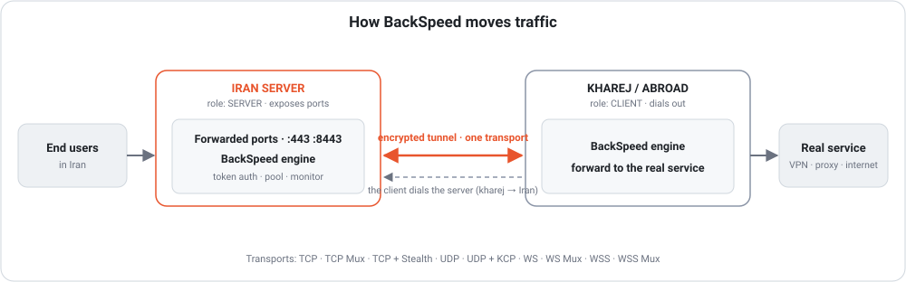

<h1 align="center">BackSpeed</h1>

<p align="center">
  <b>One Go binary that keeps a service reachable from Iran — through whatever<br>the route will actually carry today.</b>
</p>

<p align="center">
  <a href="https://github.com/SpeedwiT/BackSpeed/releases/latest">
    
  </a>
  <a href="go.mod">
    
  </a>
  <a href="LICENSE">
    
  </a>
  <a href="https://github.com/SpeedwiT/BackSpeed/stargazers">
    
  </a>
  <a href="https://github.com/SpeedwiT/BackSpeed/releases">
    
  </a>
</p>

<p align="center">
  <a href="tutorial/README.md">Tutorials</a> ·
  <a href="docs/README.md">Documentation</a> ·
  <a href="README_FA.md">فارسی</a> ·
  <a href="https://t.me/Speedw_IT">Telegram</a> ·
  <a href="https://t.me/SpeedwIT">Community</a>
</p>

---

## Why this exists

A route from Iran to abroad is not a stable thing. It changes during the day, it
degrades without warning, and the protocol that worked last week is not always
the protocol that works now.

Most tunnel tools give you one transport and ask you to hope. BackSpeed gives
you **twelve**, plus the ability to **measure the route first** and pick one —
and then to keep checking, fail over, and switch when the choice stops working.

The result is a tunnel that you configure once and then largely stop thinking
about.

---

## What you get

* **Interactive CLI** — a menu-driven wizard on both ends; a setup link makes
  the kharej side a single paste.
* **Twelve reverse transports** — TCP, TCP Mux, TCP + Stealth, TCP + PCK, UDP,
  UDP + KCP + FEC, UDP + QUIC, WS, WS Mux, WSS, WSS Mux and xDi (ICMP).
* **Layer-3 direct tunnel** — a private point-to-point interface carrying real
  IP packets, for when inbound access to Iran is not available at all.
* **Link Test** — measures latency, jitter and packet loss over the real path
  and recommends a transport for it.
* **Failover and fallback** — several addresses per tunnel, and a chain of
  transports to fall through when one stops getting traffic.
* **Health check and watchdog** — detects a stalled tunnel, applies a suggested
  fix, restarts what is dead.
* **Web monitoring panel** — CPU, RAM, disk, traffic, tunnel state and logs on
  port 7777, with two-factor auth and scoped API tokens.
* **Managed servers** — register remote machines over SSH and build both ends
  of a tunnel from the panel without repeating the setup by hand.
* **Telegram monitoring** — status reports, alerts and recovery messages, relayed
  through the tunnel when Telegram itself is unreachable.
* **Backup, rollback, verified updates** — restore points before every change,
  SHA-256 verified release archives, offline install when GitHub is blocked.

---

## How it works

The usual deployment is a **reverse tunnel**: the kharej machine dials out to
the Iran machine, and users reach the service through the Iran side.

```text
                    INTERNET
                       │
                       │ user traffic
                       ▼
                ┌──────────────┐
                │ IRAN SERVER  │
                │ Exposed port │
                └──────┬───────┘
                       │  BackSpeed tunnel
                       ▼
                ┌──────────────┐
                │ KHAREJ SERVER│
                │ Real service │
                └──────────────┘
```

```text
KHAREJ ───────────────▶ IRAN
          tunnel
```

| Server     | Setup          | Role                                                |
| ---------- | -------------- | --------------------------------------------------- |
| **Iran**   | `Setup Iran`   | Listens for the tunnel and exposes forwarded ports  |
| **Kharej** | `Setup Kharej` | Dials Iran and forwards traffic to the real service |

Because the kharej side dials out, it needs **no inbound tunnel port**. Configure
the Iran side first; it hands you a one-line setup link that carries the
address, port and token over to the kharej side.

<p align="center">
  
</p>

There is also a **direct tunnel**, where Iran initiates the connection instead:

```text
IRAN ─────────────────────────▶ KHAREJ
             tunnel
```

The `Setup → Direct` wizard builds a full layer-3 tunnel — GRE encapsulation,
Noise encryption, automatic MTU handling and full IP routing over a private
point-to-point interface:

```text
┌──────────────┐                  ┌──────────────┐
│ IRAN         │                  │ KHAREJ       │
│ 10.10.0.1    │══════════════════│ 10.10.0.2    │
└──────────────┘                  └──────────────┘
```

See [Direct layer-3 tunnel](docs/l3-direct-tunnel.md).

---

## Before you start

Four things cause most first-time problems.

**1. The roles.** Users → Iran → Kharej → real service. Iran listens, kharej
dials. Getting these backwards is the single most common mistake.

**2. The token.** The Iran side generates a random 64-character token and both
ends must use exactly the same one. A mismatch looks like a dead tunnel —
especially on encrypted transports, where the server may deliberately not
answer.

**3. Port mappings.** `443` means Iran `:443` → kharej `127.0.0.1:443`.
`443=127.0.0.1:2096` means Iran `:443` → kharej `127.0.0.1:2096`. Explicit
backends, several backends and port ranges all work. See
[Port mappings](docs/port-mappings.md).

**4. UDP.** Forwarded ports carry **TCP by default**. If the service behind the
tunnel needs UDP — Xray / 3x-ui, Shadowsocks, WireGuard, DNS, games — turn it on
per tunnel. See [Forwarded UDP](docs/forwarded-udp.md).

The full walkthrough is [Before you start](tutorial/before-you-start.md).

---

## Quick start

### 1. Install

On both servers:

```bash
bash <(curl -fsSL https://raw.githubusercontent.com/SpeedwiT/BackSpeed/main/install.sh)
```

Then:

```bash
sudo backspeed
```

The installer downloads the release for your architecture, verifies its published
SHA-256 checksum, installs it and opens the CLI. It refuses to install anything
that does not verify.

```text
x86_64  → amd64
aarch64 → arm64
armv7   → armv7
```

If the server cannot reach GitHub at all, use the
[offline installation](#offline-installation). See
[Installation](docs/install.md).

### 2. Configure the Iran server

```text
sudo backspeed
1. Setup Iran → Reverse → transport → Iran IP/domain → tunnel port
→ forwarded ports → name → token (Enter) → UDP → transport's own questions
→ tuning → Create This Tunnel
```

The summary shows a one-line **setup link** (`backspeed://…`). Copy it.
For a first deployment, **TCP** is the simplest starting point.

### 3. Configure the kharej server

```text
sudo backspeed
2. Setup Kharej → Reverse → same transport
→ Setup Link → paste the link → name → Create This Tunnel
```

`Manual` is there too, if you would rather type the Iran address, tunnel port and
token yourself.

### 4. Check it

```text
Manage → Status        the tunnel's own report
Manage → Health Check  server, panel and tunnels, with a fix for what it finds
Manage → Link Test     latency, jitter and loss, plus a transport recommendation
```

See [Choosing a transport](docs/choosing-a-transport.md).

---

## Which transport should I use?

| Situation                                         | Start with          |
| ------------------------------------------------- | ------------------- |
| Clean / ordinary route                            | **TCP**             |
| Many short-lived connections                      | **TCP Mux**         |
| TCP is filtered or unstable                       | **TCP + Stealth**   |
| TCP connects but stalls, resets or gets throttled | **TCP + PCK**       |
| You specifically need raw UDP                     | **UDP**             |
| Lossy route / real-time traffic / gaming          | **UDP + KCP + FEC** |
| You want to test QUIC                             | **UDP + QUIC**      |
| HTTP/WebSocket traffic is useful                  | **WS / WS Mux**     |
| HTTPS-style traffic is required                   | **WSS / WSS Mux**   |
| TCP and UDP are filtered but ICMP works           | **xDi (ICMP)**      |
| Inbound access to Iran is unavailable             | **Direct tunnel**   |

When unsure, run `Manage → Link Test` on the kharej side and let it measure the
route and recommend one.

| Transport           | Family       |   Encryption  | PROXY v2 | Requirements        |
| ------------------- | ------------ | :-----------: | :------: | ------------------- |
| TCP                 | TCP          |       —       |     ✓    | —                   |
| TCP Mux             | TCP          |       —       |     ✓    | —                   |
| **TCP + Stealth**   | TCP          |     Noise     |     ✓    | —                   |
| **TCP + PCK**       | TCP          | Token-derived |     ✓    | Linux + root        |
| UDP                 | UDP          |       —       |     —    | UDP open            |
| **UDP + KCP + FEC** | UDP          | Token-derived |     ✓    | UDP open            |
| UDP + QUIC          | UDP          |    TLS 1.3    |     ✓    | UDP open            |
| WS                  | WebSocket    |       —       |     —    | —                   |
| WS Mux              | WebSocket    |       —       |     ✓    | —                   |
| WSS                 | WebSocket    |      TLS      |     —    | Certificate         |
| WSS Mux             | WebSocket    |      TLS      |     ✓    | Certificate         |
| **xDi (ICMP)**      | Experimental | Token-derived |     ✓    | Linux + root + ICMP |

Notes on the four that are usually the answer:

* **TCP + Stealth** wraps TCP in a Noise record layer — no TLS ClientHello, no
  recognizable protocol header. For when plain TCP is being identified and cut.
* **TCP + PCK** builds TCP segments outside the kernel's connection state. For
  when TCP connects and then stalls, resets or gets throttled. Linux + root on
  both ends.
* **UDP + KCP + FEC** is reliable and ordered over UDP with forward error
  correction — for lossy routes where TCP backs off too aggressively.
* **xDi** carries KCP inside ICMP echo packets, for the case where TCP and UDP
  are both filtered but ICMP still gets through. A last resort, not a starting
  point.

Full reference: [Transports](docs/transports.md) ·
[Choosing a transport](docs/choosing-a-transport.md).

---

## Reliability

**Backup addresses.** A tunnel can carry several server addresses. BackSpeed
health-scores them, fails over between them and load-balances across the healthy
ones. See [Failover & load balancing](docs/failover-load-balancing.md).

**Transport fallback.** A tunnel can also carry a chain:

```toml
transport = "wss"

fallback_transports = ["quic", "kcp", "tcpmux"]
```

When the active carrier stops getting through, it moves down the chain. See
[Transport fallback](docs/transport-fallback.md).

**Self-healing.** A watchdog watches the tunnel snapshots and restarts anything
that has stopped or stalled. Services are systemd units and survive reboots.

**Automatic rollback.** Updates and configuration changes write a restore point
first, and roll back on their own if the tunnel does not come back.

---

## Diagnostics and performance

* **Link Test** — latency, jitter and packet loss over the real path, plus a
  transport recommendation.
* **Health Check** — server, panel and tunnels, with a suggested fix for each
  problem it finds.
* **Tunnel Metrics** — traffic, connections, and transport-specific numbers such
  as KCP retransmissions, loss and FEC repairs.

Four performance presets — **Balance**, **Turbo**, **Aggressive** and
**Throughput** — tune the queues and transport behaviour, and the CLI includes
kernel/network optimisation. See
[Performance presets](docs/performance-presets.md) ·
[Performance notes](docs/performance-notes.md) ·
[Tunnel metrics](docs/tunnel-metrics.md) ·
[Health check](docs/health-check.md).

---

## Security

Encrypted transports: **TCP + Stealth**, **TCP + PCK**, **UDP + KCP + FEC**,
**UDP + QUIC**, **WSS**, **WSS Mux** and **xDi**. On plain transports the tunnel
credential itself is not encrypted by the transport, so choose accordingly.

The web panel supports password authentication, two-factor authentication,
recovery codes, scoped API tokens and authorization records — see
[Access control](docs/access-control.md).

Release archives are verified against the published SHA-256 checksum, and an
archive that cannot be verified is refused rather than installed. See
[Updates & rollback](docs/updates.md).

Backends can see the real client address through **PROXY protocol v2**, so
per-user and per-device limits behind the tunnel keep working — see
[Real client IP](docs/real-client-ip.md).

---

## Web panel

A monitoring dashboard on **port 7777**:

```text
Iran server
    │
    └── Web Panel :7777
```

CPU, RAM, disk, traffic, tunnel state, real ping, logs, backup and Telegram
settings, and the panel's own security settings. It supports HTTPS, custom
certificates, two-factor authentication and API access control. Tunnel creation
stays in the CLI; the panel is for watching and operating what is running.

See [Web Panel](docs/web-panel.md) ·
[Screen by screen](docs/web-panel-screens.md).

From the panel you can also register **managed servers** over SSH and build or
operate both ends of a tunnel without repeating the setup — see
[Managed servers](docs/managed-servers.md).

**Telegram** can carry periodic status reports, tunnel status, resource alerts
and recovery messages, and can relay its own connection through the tunnel when
Telegram is not directly reachable — see [Telegram bot](docs/telegram-bot.md) ·
[Alerts](docs/alerts.md).

---

## Backup and updates

`Backup & Restore` writes a portable `.tar.gz` of tunnel configs, panel settings,
the panel password, Telegram settings, TLS certificates and scheduled tasks. It
restores onto another machine. See
[Backup & Restore](docs/backup-restore.md).

Updates come from the GitHub release system: detect, download the archive for
your architecture, verify the published SHA-256, install, and roll back to the
restore point if the tunnel does not return. When the server cannot reach GitHub
it can update through a tunnel peer; when neither path exists, update offline.

See [Updates & rollback](docs/updates.md).

---

## Offline installation

Download the release anywhere with internet, copy it to the server, install it
there. Nothing is fetched from the VPS.

```bash
scp install.sh SHA256SUMS backspeed_linux_amd64.tar.gz root@SERVER_IP:/root/

ssh root@SERVER_IP "cd /root && sudo bash install.sh"
```

Or by hand, after checking the checksum:

```bash
sha256sum backspeed_linux_amd64.tar.gz
tar xzf backspeed_linux_amd64.tar.gz

mkdir -p /etc/backspeed /root/BackSpeed/backups
install -m 0755 backspeed /usr/local/bin/backspeed
echo /root/BackSpeed > /etc/backspeed/install_path

sudo backspeed
```

See [Installation](docs/install.md).

---

## Server layout

```text
/root/BackSpeed
/root/BackSpeed/backups
/etc/backspeed
/usr/local/bin/backspeed
```

See [Server layout](docs/server-layout.md).

---

## Documentation

Setup is in `tutorial/`, reference is in `docs/`.

### Tutorials

* [Before you start](tutorial/before-you-start.md)
* [TCP](tutorial/tcp.md) · [TCP Mux](tutorial/tcp-mux.md) ·
  [TCP + Stealth](tutorial/tcp-stealth.md) · [TCP + PCK](tutorial/tcp-pck.md)
* [UDP](tutorial/udp.md) · [UDP + KCP + FEC](tutorial/udp-kcp-fec.md) ·
  [UDP + QUIC](tutorial/udp-quic.md)
* [WS / WS Mux](tutorial/websocket.md) · [WSS / WSS Mux](tutorial/websocket-tls.md)
* [xDi / ICMP](tutorial/xdi-icmp.md)
* [Forwarded UDP](tutorial/udp-forwarding.md) ·
  [Behind X-UI / 3x-ui / Marzban](tutorial/behind-a-panel.md) ·
  [Direct tunnel](tutorial/direct-tunnel.md) ·
  [IP Spoofing](tutorial/ip-spoofing.md)

### Reference

* **Architecture** — [Architecture](docs/architecture.md) ·
  [Design decisions](docs/design-decisions.md) ·
  [Configuration reference](docs/config-reference.md)
* **Transports & networking** — [Transports](docs/transports.md) ·
  [Choosing a transport](docs/choosing-a-transport.md) ·
  [Transport fallback](docs/transport-fallback.md) ·
  [Direct layer-3 tunnel](docs/l3-direct-tunnel.md) ·
  [Port mappings](docs/port-mappings.md) · [Forwarded UDP](docs/forwarded-udp.md) ·
  [TCP MSS clamp](docs/mss-clamp.md) · [Filtered / dirty IP](docs/filtered-or-dirty-ip.md) ·
  [WSS camouflage](docs/camouflage.md) · [IP Spoofing](docs/ip-spoofing.md)
* **Operations** — [Installation](docs/install.md) ·
  [CLI menu](docs/cli-menu.md) · [Web Panel](docs/web-panel.md) ·
  [Managed servers](docs/managed-servers.md) · [Monitor service](docs/monitor-service.md) ·
  [Troubleshooting](docs/troubleshooting.md)
* **Reliability & maintenance** — [Backup & Restore](docs/backup-restore.md) ·
  [Updates & rollback](docs/updates.md) · [Limits](docs/limits.md) ·
  [Log schema](docs/log-schema.md)
* **Development** — [Contributing](CONTRIBUTING.md) ·
  [Releasing](docs/releasing.md)

> Every documentation page carries a Persian summary where applicable.

---

## Support and community

* Star the repository if it is useful to you.
* Report bugs through [GitHub Issues](https://github.com/SpeedwiT/BackSpeed/issues).
* Pull requests are welcome — read [CONTRIBUTING.md](CONTRIBUTING.md) first.

**Telegram** · Channel [@Speedw_IT](https://t.me/Speedw_IT) ·
Community [@SpeedwIT](https://t.me/SpeedwIT)

---

## License

BackSpeed is free software, released under the
**GNU Affero General Public License v3.0 (AGPL-3.0)**.

* [LICENSE](LICENSE) — the full licence text
* [NOTICE](NOTICE) — additional terms and required notices
* [TRADEMARK.md](TRADEMARK.md) — naming and branding terms

You may use, study, modify, redistribute and build a business on it under those
terms.
